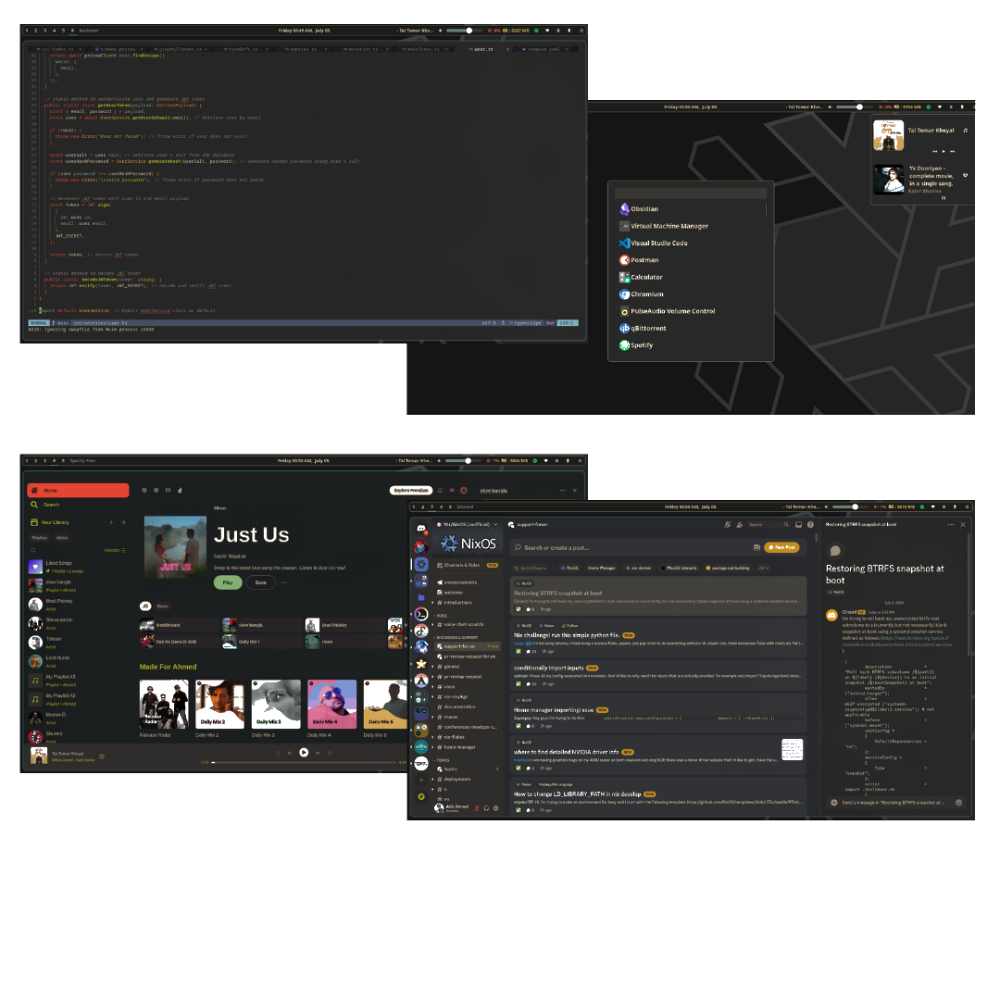

<p align="center"></p>

<h2 align="center">Akib | NixOS Config Go Wilde</h2>

<h2 align="center"> Current System Preview </h2>



# 1. Installation My version of NixOS

<details>

<summary>NixOS setup using falke and home-manager as module. Hyperland as default Window Manager.</summary>

## Installation Prerequisites

Before you begin, ensure you have the following:

- A Linux system with an EFI-enabled BIOS (for BIOS installations, adjust the commands accordingly).
- The disk identifier (`/dev/sdX`) for the target installation disk. Replace `sdX` with the appropriate disk identifier for your system.

## Installation Steps

**Install NixOS**

```bash
sudo su
nix-shell -p git --command 'nix run github:akibahmed229/nixos#akibOS --experimental-features "nix-command flakes"'
```

> **NOTE**:
> During the installation process, [akibOS](./pkgs/akibOS/default.nix) will prompt for the disk identifier (`/dev/sdX`) , hostname and the username. Replace `sdX` with the appropriate disk identifier for your system.
> also replace `hostname` with (available options: desktop, virt) and `username` with your desired username.
> the default password for the user is `123456` you can change it later.

Congratulations! You have successfully installed NixOS with a Btrfs filesystem. Enjoy your fault-tolerant, advanced feature-rich, and easy-to-administer system!

> **NOTE**:
> The Configuration will clone from this repository and will be placed in `/home/username/.config/flake` respectively.
> For more information about NixOS and its configuration options, refer to the official [NixOS documentation](https://nixos.org/).

**After installation:**

- Open a terminal with "Super + Return".
- Navigate to the `~/.config/flake` directory in the terminal.
- Fix permission issues by running these commands:

```bash
chown -R yourUserName:users *
chown -R yourUserName:users .*
```

</details>

# 2. File Structure

<details>
  <summary>File Structure</summary>
  Structurally, this flake is designed to interpret as much information as possible from the directories it manages. Rather than have a "master list" of configurations to manage, adding files to the hosts/, modules/, overlays/, & pkgs/ folders will cause them to be automatically detected and configured on flake rebuild. This is achieved by programmatically determining the objects that need to be evaluated and generated. The downside of this, of course, is that there's not one "master list" to reference;

- **Flake.nix** : Main flake file for defining the system configuration

  - **lib** : Library helper functions, providing a set of functions that can be used to mange stuff in a more concise way
  - **hosts** : Host-specific configuration files
  - **home-manager** : Configuration files for desktop environment & window manager
  - **modules** : Program-specific configuration files (includes custom and predefined modules for NixOS and Home Manager)
  - **overlays** : Customize pkgs & extend entries nixpkgs itself
  - **pkgs** : Nix derivations, custom packages, and shell scripts
  - **public** : Wallpaper folder, Template for different system, & GTK/QT themes and doc
  - **flake.lock** : Lock file for the flake inputs

- **_devShell/flake.nix_** : Flake file defining the development shell

</details>

# 3. This Flake Provide

- <details>
  <summary>Overlays for custom packages and Nixpkgs</summary>
  </br>

  You can also plug this into a flake to include it into a system configuration.

  ```nix
  {
      inputs = {
       akibOS.url = "github:akibahmed229/nixos";
      };
  }
  ```

  This input can then be used as an overlay to replace the default Nixpkgs with the custom one. (nixos , home-manager)

  ```nix
  {inputs, ... }:
  {
      nixpkgs.overlays = [
         inputs.akibOS.overlays.discord-overlay # pull the latest version of discord
         inputs.akibOS.overlays.nvim-overlay # my custom nvim with nixvim
         inputs.akibOS.overlays.flatpak-overlay # patch flatpak font
         inputs.akibOS.overlays.unstable-packages # pull pkgs from unstable. be accissible through `pkgs.unstable`
      ];
  }
  ```

  </details>

- <details>
   <summary>DevShell for development environments</summary>
   </br>
   
   you can access the development shell by running the following command:
   
   ```bash
   nix develop github:akibahmed229/nixos#kernel_build_env # kernel development environment
   nix develop github:akibahmed229/nixos#jupyter # jupyter development environment
   nix develop github:akibahmed229/nixos#gtk3_env # gtk3 development environment
   nix develop github:akibahmed229/nixos#prisma # prisma query engine
   ```

  </details>

- <details>
   <summary>Custom Pkgs & Shell scripts</summary>
   </br>
   
   you can access the shell scripts by running the following command:
   
   ```bash
   nix run github:akibahmed229/nixos#nix-update-input # this will update specific flake input of you flake.nix
   nix run github:akibahmed229/nixos#nixvim # you can try my custom nixvim
   nix run github:akibahmed229/nixos#wallpaper # you need to define your env variable $WALLPAPER
   ```

  You can also plug this into a flake to include it into a system configuration.

  ```nix
  {
      inputs = {
       akibOS.url = "github:akibahmed229/nixos";
      };
  }
  ```

  This input can then be used as Nixpkgs with the custom one. (nixos , home-manager)

  From NixOS Configuration

  ```nix
  {inputs, pkgs,... }:
  {
      environment.systemPackages = with pkgs; [
        inputs.akibOS.packages.${pkgs.system}.wallpaper # make sure you have set the env variable $WALLPAPER
        inputs.akibOS.packages.${pkgs.system}.custom_nsxiv # my modify version of nsxiv
      ];

      # custom pkgs for sddm theme for
      services.displayManager.sddm = {
        enable = true;
        theme = ''${inputs.akibOS.packages.${pkgs.system}.custom_sddm.override {
            imgLink = {
              url = "https://raw.githubusercontent.com/akibahmed229/nixos/main/public/wallpaper/nix-wallpaper-nineish-dark-gray.png"; # you can change the image for sddm theme
              sha256 = "07zl1dlxqh9dav9pibnhr2x1llywwnyphmzcdqaby7dz5js184ly"; # change the hash accordingly
            };
          }}'';
      };
  }
  ```

  From Home Manager

  ```nix
  {inputs, pkgs,... }:
  {
     home.packages  = with pkgs; [
        inputs.akibOS.packages.${pkgs.system}.wallpaper # make sure you have set the env variable $WALLPAPER
        inputs.akibOS.packages.${pkgs.system}.custom_nsxiv # my modify version of nsxiv
      ];
  }
  ```

  </details>

- <details>
     <summary>My Custom library helper function that will allow multiple hosts with easy-to-administer</summary>
     </br>

  NixOS configuration ( flake & home-manager as module) with my mkSystem lib function

  ```bash
    nix flake init -t github:akibahmed229/nixos#nixos
  ```

  Standalone home-manager configuration with my mkSystem lib function

  ```bash
    nix flake init -t github:akibahmed229/nixos#homeManager
  ```

  Nix-On-Droid configuration for Android (flake & home-manager as module) with my mkSystem lib function

  ```bash
    nix flake init -t github:akibahmed229/nixos#nixOnDroid
  ```

    </details>
