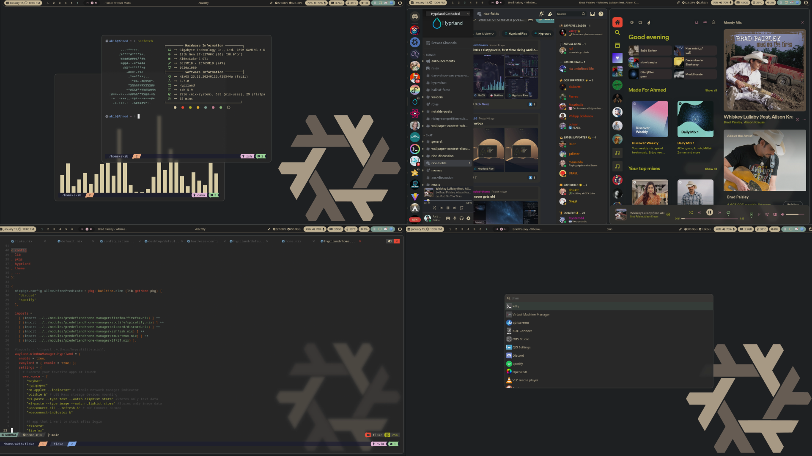

<p align="center"></p>

<h2 align="center">Akib | NixOS Config Go Wilde</h2>

<h2 align="center"> Current System Preview </h2>



## Table of Contents

<details>
  <summary>Table of Contents</summary>

- [NixOS Btrfs Installation Guide](#1-btrfs-installation-my-version-of-nixos)
  - [Prerequisites](#installation-prerequisites)
  - [Installation Steps](#installation-steps)
- [FAQ](#2-faq)
- [File Structure](#3-file-structure)
</details>

# 1. Installation My version of NixOS

<details>

<summary>NixOS setup using falke and home-manager as module. Hyperland as default Window Manager.</summary>

## Installation Prerequisites

Before you begin, ensure you have the following:

- A Linux system with an EFI-enabled BIOS (for BIOS installations, adjust the commands accordingly).
- The disk identifier (`/dev/sdX`) for the target installation disk. Replace `sdX` with the appropriate disk identifier for your system.

## Installation Steps

1. **Install NixOS**

```bash
sudo su
nix-shell -p git --command 'nix run github:akibahmed229/nixos#akibOS --experimental-features "nix-command flakes"'
```

Note: During the installation process, [akibOS](./pkgs/shellscript/akibOS.nix) will prompt for the disk identifier (`/dev/sdX`) , hostname and the username. Replace `sdX` with the appropriate disk identifier for your system.
also replace `hostname` with your desired hostname and `username` with your desired username.
the default password for the user is `123456` you can change it later.

Congratulations! You have successfully installed NixOS with a Btrfs filesystem. Enjoy your fault-tolerant, advanced feature-rich, and easy-to-administer system!

For more information about NixOS and its configuration options, refer to the official [NixOS documentation](https://nixos.org/).

</details>

# 2. FAQ

<details>
  <summary>Where can I learn about everything Nix?</summary>

- Nix and NixOS
  - [Website](https://nixos.org/)
  - [Manuals](https://nixos.org/learn.html)
  - [Manual](https://nixos.org/manual/nix/stable/introduction.html)
  - [Packages](https://search.nixos.org/packages) and [Options](https://search.nixos.org/options?)
  - [Unofficial Wiki](https://nixos.wiki/)
  - [Wiki Resources](https://nixos.wiki/wiki/Resources)
  - [Nix Pills](https://nixos.org/guides/nix-pills/)
  - [Some Blogs](https://www.ianthehenry.com/posts/how-to-learn-nix/), [More Blogs](https://christine.website/blog)
  - [Config Collection](https://nixos.wiki/wiki/Configuration_Collection)
- Home-manager
  - [Official Repo](https://github.com/nix-community/home-manager)
  - [Manual](https://nix-community.github.io/home-manager/)
  - [Appendix A](https://nix-community.github.io/home-manager/options.html)
  - [Appendix B](https://nix-community.github.io/home-manager/nixos-options.html)
  - [Appendix D](https://nix-community.github.io/home-manager/tools.html)
  - [NixOS wiki](https://nixos.wiki/wiki/Home_Manager)
- Flakes
  - [NixOS wiki](https://nixos.wiki/wiki/Flakes)
  - [Manual](https://nixos.org/manual/nix/stable/command-ref/new-cli/nix3-flake.html)
  - [Some Blogs](https://www.tweag.io/blog/2020-05-25-flakes/), [More Blogs](https://christine.website/blog/nix-flakes-3-2022-04-07)
- Nix-Darwin
  - [Official Repo](https://github.com/LnL7/nix-darwin/)
  - [Manual](https://daiderd.com/nix-darwin/manual/index.html)
  - [Mini-Wiki](https://github.com/LnL7/nix-darwin/wiki)

</details>

# 3. File Structure

<details>
  <summary>File Structure</summary>

- Flake.nix : Main flake file for defining the system configuration
    <details>
      <summary>Flake Inputs</summary>

      - home-manager : Configuration files for Home Manager and desktop environment
      - hosts : Host-specific configuration files
      - modules : Program-specific configuration files (includes custom and predefined modules for NixOS and Home Manager)
      - public : Wallpaper folder, GTK, and QT themes
      </details>

- flake.lock : Lock file for the flake inputs

- devShell/flake.nix : Flake file defining the development shell

- pkgs : Flake file defining Nix derivations, custom packages, and shell scripts
</details>
