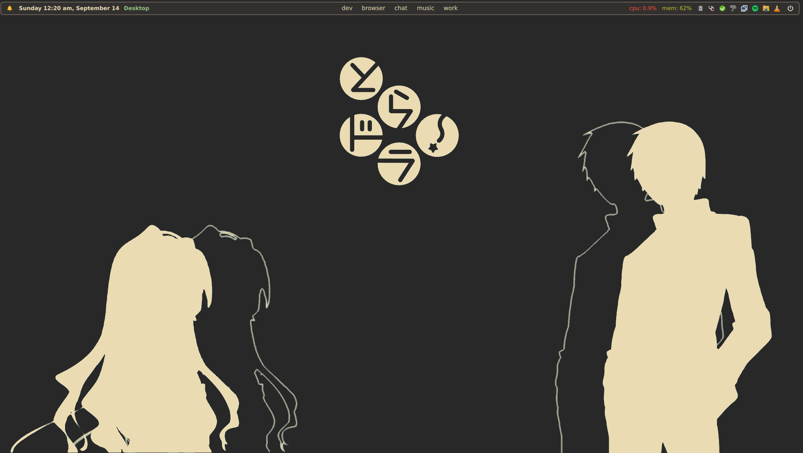
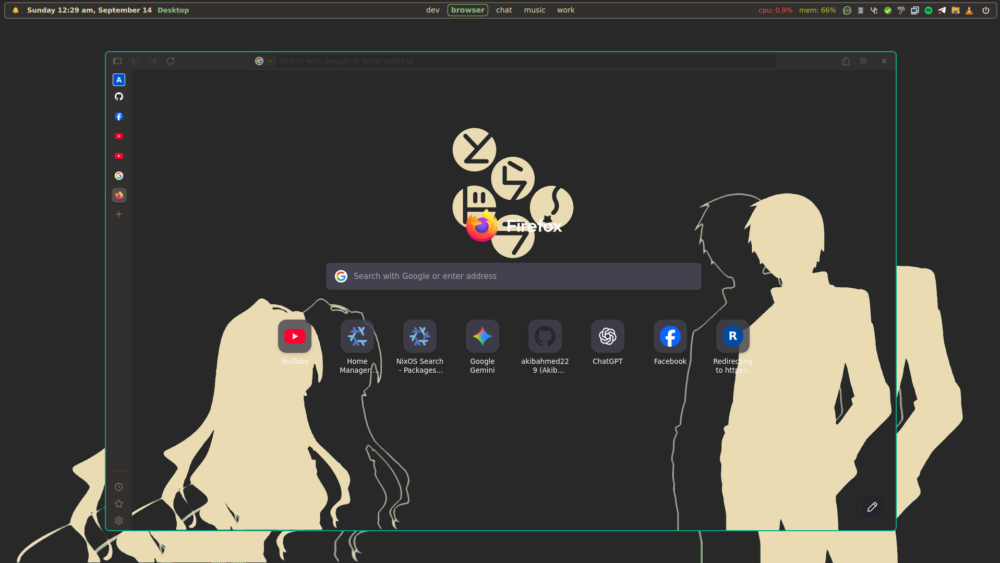
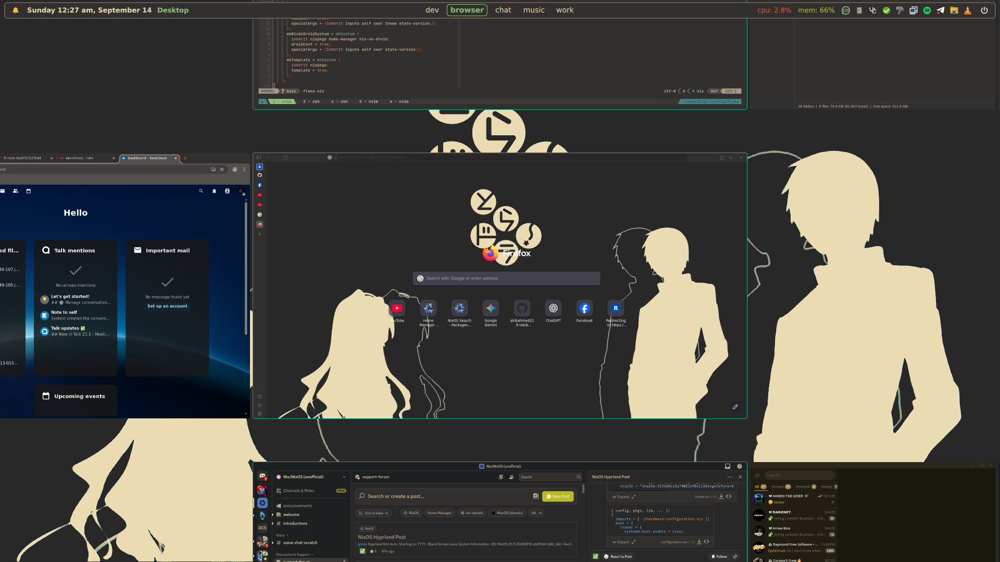
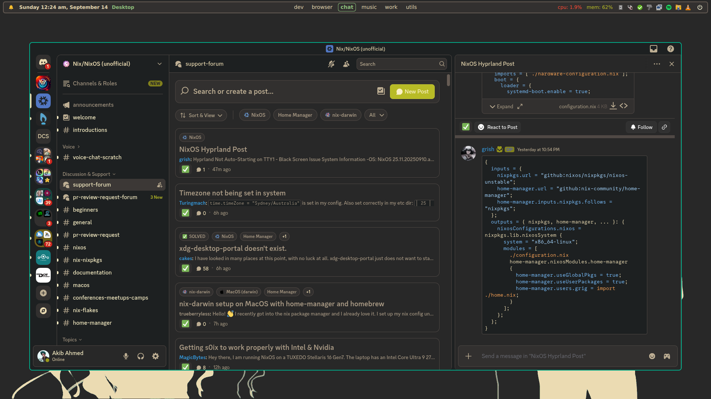
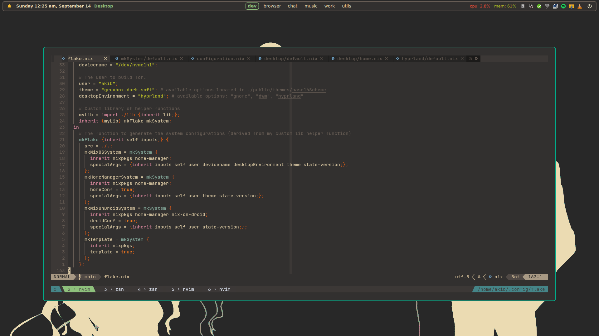
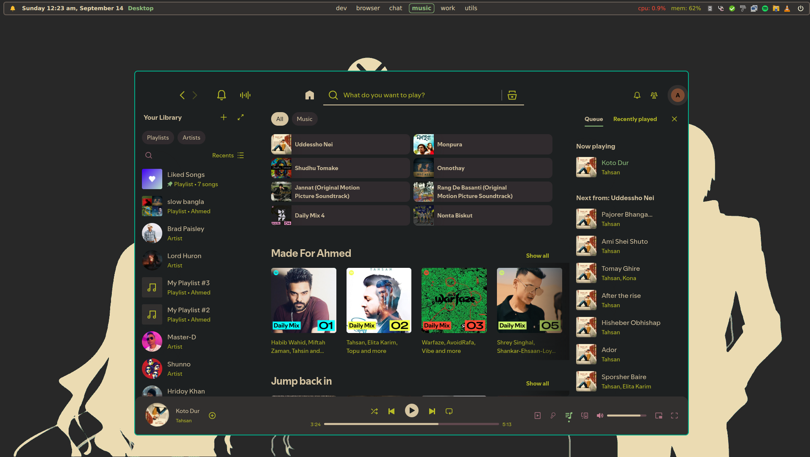

<h2 align="center">Akib | NixOS Config Go Wilde</h2>

<h2 align="center"> Current System Preview </h2>

|                                                |                                                |
| :--------------------------------------------: | :--------------------------------------------: |
|  |  |
|  |  |
|  |  |
|                                                |                                                |

# 1. Installation — My Version of NixOS

<details>
  <summary>NixOS setup using Flake + Home Manager. Niri as the default WM.</summary>

## Overview

This repository provides two helper scripts (flakes) to automate a two-stage installation:

- **Pre-install** (`preInstall`) — run from a Nix live ISO. Partitions & formats disks, bootstraps a minimal flake, optionally updates flake defaults, generates hardware config, and runs `nixos-install`.
- **Post-install** (`postInstall`) — run on the newly installed system. Optionally imports secrets from an encrypted USB (for the maintainer user), updates the flake, clones the repo, and applies the system configuration with `nixos-rebuild`.

Both scripts check for internet connectivity before proceeding.

## Prerequisites

- A Linux machine (UEFI recommended). If using legacy BIOS, adjust commands accordingly.
- A target disk device (e.g. `/dev/sda`) — know your device identifier.
- Internet connection (scripts use `ping` to verify).
- For secret import (optional): an encrypted USB containing SSH keys and SOPS/AGE keys (used only when running as the maintainer user).

## Installation Steps

<details>
  <summary>Step 0 — Prepare & boot the NixOS live ISO (if needed)</summary>

Prepare a bootable NixOS USB and boot into the live environment. Ensure network access (wired is easiest).

</details>

<details>
  <summary>Step 1 — Pre-install (run from the live ISO)</summary>

Run:

```bash
sudo nix run github:akibahmed229/nixos#preInstall --experimental-features "nix-command flakes"
```

> **NOTE**:
> What the `preInstall` script does:

> - Verifies internet connectivity.
> - Prompts for:
>   - **Username** (e.g. `akib`)
>   - **Hostname** (`desktop` or `virt`)
>   - **Device** (e.g. `/dev/sda`)
> - Initializes a minimal flake under `/home/<username>/flake` using the `minimal` template.
> - Formats and partitions disks using `disko` (the script invokes `nix run github:nix-community/disko`).
> - Optionally updates `flake.nix` defaults (username & device) via `sed` if you confirm.
> - Generates or copies `hardware-configuration.nix`:
>   - Uses the bundled hardware configuration for the default maintainer (`akib` + `desktop`).
>   - Otherwise runs `nixos-generate-config --root /mnt` and copies `/mnt/etc/nixos/hardware-configuration.nix` into the flake.
> - Runs `nixos-install --no-root-passwd --flake "/home/<username>/flake#<hostname>"`.
> - The default password for the user is `123456` you can change it later from `./hosts/nixos/{desktop,virt}/users/main/default.nix`.

**Important:** the script will ask for confirmation before changing `flake.nix`. You can still edit `flake.nix` manually later.

</details>

<details>
  <summary>Step 2 — Post-install (run on the installed system)</summary>

After rebooting into your new NixOS installation, run:

```bash
nix run github:akibahmed229/nixos#postInstall
```

> **NOTE**:
> What the `postInstall` script does:

> Detects current user and system hostname.
> Verifies internet connectivity.
> If running as the repository maintainer user (e.g. `akib`) it will:
>
> - Prompt for an encrypted USB device path (e.g. `/dev/sdb`).
> - Mount the LUKS USB, and copy SSH keys and AGE/SOPS keys into:
>   - `/home/<username>/.ssh/` (gitlab key)
>   - `/var/lib/sops-nix/` and `/home/<username>/.config/sops/age/` (sops/age keys)
> - Configure `~/.ssh/config` to use the GitLab key.
>
> Updates the flake metadata in the cloned repo (replaces defaults like username & device).

> Removes the `secrets` input from `flake.nix` (so the flake update won't attempt to fetch the private secrets repo).

> Clones (shallow) this repository into the script's working flake directory.

> Runs `nixos-rebuild switch --flake ".#<hostname>"` (applies the system configuration).

</details>

</details>

# 2. File Structure

<details>
  <summary>Structurally, this flake is designed to interpret as much information as possible from the directories it manages. Rather than have a "master list" of configurations to manage, adding files to the hosts/, modules/, overlays/, & pkgs/ folders will cause them to be automatically detected and configured on flake rebuild. This is achieved by programmatically determining the objects that need to be evaluated and generated. The downside of this, of course, is that there's not one "master list" to reference;</summary>

<h3 align="center">System Architecture </h3>



**Designing my config around a small set of custom helpers in lib**. For example:

- **mkSystem** and **mkFlake** handle pulling everything together in one place, so each system lives in its own directory and is built the same way. This is achieved by programmatically determining the objects that need to be evaluated and generated.

- **mkImport** and **mkScanPath** let me bulk-import predefined modules or user configs without writing long lists of imports by hand. I just point to a folder and it picks them up.

- Each user/module has enable flags (**enableSystemConf**, **enableHomeConf**) and a clear schema, so I don’t have to wonder what’s active — it’s explicit.

So instead of manually tracking dozens of scattered imports, I rely on these patterns to keep things predictable and scalable.

| **File/Folder**  | **Purpose**                                                                                                  |
| ---------------- | ------------------------------------------------------------------------------------------------------------ |
| **flake.nix**    | Main flake file for defining the system configuration                                                        |
| **flake.lock**   | Lock file for the flake inputs                                                                               |
| **lib**          | Library helper functions, providing a set of functions that can be used to mange stuff in a more concise way |
| **hosts**        | Host-specific configuration files                                                                            |
| **home-manager** | Configuration files for desktop environment & window manager                                                 |
| **modules**      | Program-specific configuration files (includes custom and predefined modules for NixOS and Home Manager)     |
| **overlays**     | Customize pkgs & extend entries nixpkgs itself                                                               |
| **pkgs**         | Nix derivations, custom packages, and shell scripts                                                          |
| **public**       | Wallpaper folder, Template for different system, & GTK/QT themes and doc                                     |
| **devShell**     | Flake file defining the development shell                                                                    |

</details>

# 3. This Flake Provide

- <details>
  <summary>Overlays for custom packages and Nixpkgs</summary>
  </br>

  You can also plug this into a flake to include it into a system configuration.

  ```nix
  {
      inputs = {
       akibOS.url = "github:akibahmed229/nixos";
      };
  }
  ```

  This input can then be used as an overlay to replace the default Nixpkgs with the custom one. (nixos , home-manager)

  ```nix
  {inputs, ... }:
  {
      nixpkgs.overlays = [
         inputs.akibOS.overlays.discord-overlay # pull the latest version of discord
         inputs.akibOS.overlays.nvim-overlay # my custom nvim with nixvim
         inputs.akibOS.overlays.flatpak-overlay # patch flatpak font
         inputs.akibOS.overlays.unstable-packages # pull pkgs from unstable. be accissible through `pkgs.unstable`
      ];
  }
  ```

  </details>

- <details>
   <summary>DevShell for development environments</summary>
   </br>
   
   you can access the development shell by running the following command:
   
   ```bash
   nix develop github:akibahmed229/nixos#kernel_build_env # kernel development environment
   nix develop github:akibahmed229/nixos#jupyter # jupyter development environment
   nix develop github:akibahmed229/nixos#gtk3_env # gtk3 development environment
   nix develop github:akibahmed229/nixos#prisma # prisma query engine
   ```

  </details>

- <details>
   <summary>Custom Pkgs & Shell scripts</summary>
   </br>
   
   you can access the shell scripts by running the following command:
   
   ```bash
   nix run github:akibahmed229/nixos#nix-update-input # this will update specific flake input of you flake.nix
   nix run github:akibahmed229/nixos#nixvim # you can try my custom nixvim
   nix run github:akibahmed229/nixos#wallpaper # you need to define your env variable $WALLPAPER
   ```

  You can also plug this into a flake to include it into a system configuration.

  ```nix
  {
      inputs = {
       akibOS.url = "github:akibahmed229/nixos";
      };
  }
  ```

  This input can then be used as Nixpkgs with the custom one. (nixos , home-manager)

  From NixOS Configuration

  ```nix
  {inputs, pkgs,... }:
  {
      environment.systemPackages = with pkgs; [
        inputs.akibOS.packages.${pkgs.stdenv.hostPlatform.system}.wallpaper # make sure you have set the env variable $WALLPAPER
        inputs.akibOS.packages.${pkgs.stdenv.hostPlatform.system}.custom_nsxiv # my modify version of nsxiv
      ];

      # custom pkgs for sddm theme for
      services.displayManager.sddm = {
        enable = true;
        theme = ''${inputs.akibOS.packages.${pkgs.stdenv.hostPlatform.system}.custom_sddm.override {
            imgLink = {
              url = "https://raw.githubusercontent.com/akibahmed229/nixos/main/public/wallpaper/nix-wallpaper-nineish-dark-gray.png"; # you can change the image for sddm theme
              sha256 = "07zl1dlxqh9dav9pibnhr2x1llywwnyphmzcdqaby7dz5js184ly"; # change the hash accordingly
            };
          }}'';
      };
  }
  ```

  From Home Manager

  ```nix
  {inputs, pkgs,... }:
  {
     home.packages  = with pkgs; [
        inputs.akibOS.packages.${pkgs.stdenv.hostPlatform.system}.wallpaper # make sure you have set the env variable $WALLPAPER
        inputs.akibOS.packages.${pkgs.stdenv.hostPlatform.system}.custom_nsxiv # my modify version of nsxiv
      ];
  }
  ```

  </details>

- <details>
     <summary>My Custom library helper function that will allow multiple hosts with easy-to-administer</summary>
     </br>

  NixOS configuration ( flake & home-manager as module) with my mkSystem lib function

  ```bash
    nix flake init -t github:akibahmed229/nixos#nixos
  ```

  Standalone home-manager configuration with my mkSystem lib function

  ```bash
    nix flake init -t github:akibahmed229/nixos#homeManager
  ```

  Nix-On-Droid configuration for Android (flake & home-manager as module) with my mkSystem lib function

  ```bash
    nix flake init -t github:akibahmed229/nixos#nixOnDroid
  ```

    </details>
